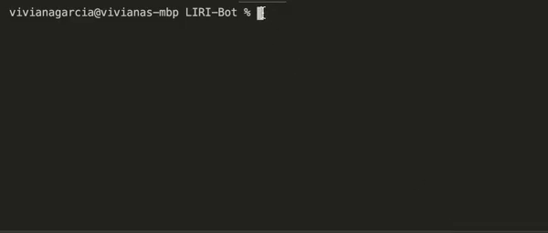
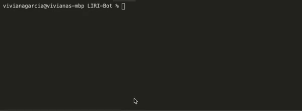
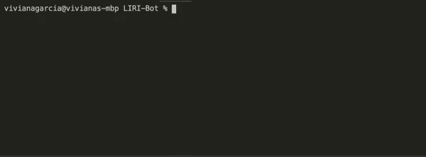

# LIRI-Bot

LIRI (Language Interpretation and Recognition Interface) is a command line node app that takes in parameters and gives you back data.

## Description

This LIRI Node application will search Spotify for songs, Bands in Town for concerts, and OMDB for movies.

The following commands will be accepted:
* concert-this
* movie-this
* spotify-this-song
* do-what-it-says

## How to use

**`node liri.js concert-this <artist name here>`**

This command will search the Bands in Town API and return the following data:

* Name of the venue

* Venue location

* Date of the Event

**`node liri.js spotify-this-song "<song name here>"`**

This command will search the Spotify API and return the following data:

* Artist(s)

* The song's name

* A preview link of the song from Spotify

* The album that the song is from

If no song is provided, the default song, The Sign - Ace of Base, will be populated.

**`node liri.js movie-this "<movie title here>"`**

This command will search the OMDB API and return the following data:

* Title of the movie.
* Year the movie came out.
* IMDB Rating of the movie.
* Rotten Tomatoes Rating of the movie.
* Country where the movie was produced.
* Language of the movie.
* Plot of the movie.
* Actors in the movie.

If no movie title is provided, the default movie "Mr. Nobody" will be populated.

**`node liri.js do-what-it-says`**

This command will search the Spotify API for the song provided in random.txt and return the data.

## Technology Used

- Visual Studio Code
- JavaScript
- Node.js
-   [Axios](https://www.npmjs.com/package/axios)
-   [Moment](https://www.npmjs.com/package/moment)
-   [DotEnv](https://www.npmjs.com/package/dotenv)

## APIs Used

-   [Node-Spotify-API](https://www.npmjs.com/package/node-spotify-api)
-   [OMDB API](http://www.omdbapi.com)
-   [Bands In Town API](http://www.artists.bandsintown.com/bandsintown-api)